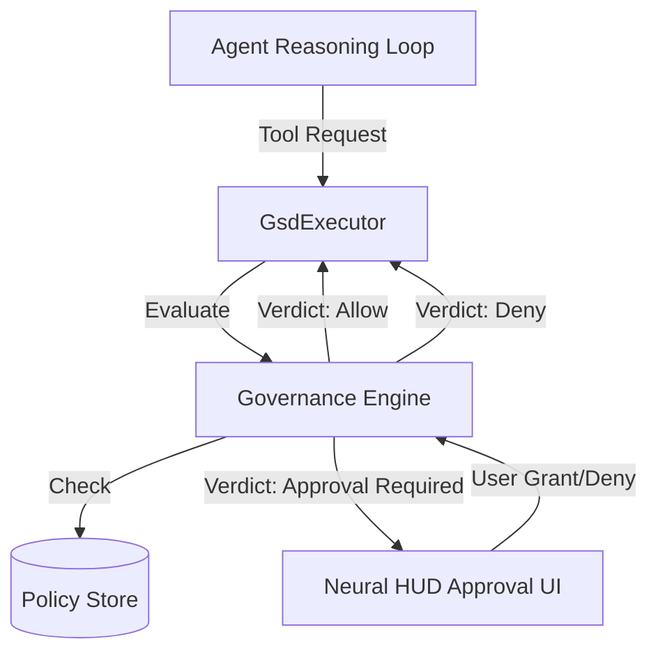

# Phase 29: Swarm Governance & Policy Layer

## Status
- **Current Phase**: 29
- **Status**: Draft
- **Objective**: Establish safety protocols and permission-based tool execution for the swarm.

## 1. Architectural Overview

The Swarm Governance Layer acts as a "firewall" between the agent's reasoning loop and the host system. It intercept all tool calls and evaluates them against a set of security policies.



## 2. Policy Schema (Draft)

We will use a declarative schema for defining tool policies.

```yaml
version: "1.0"
metadata:
  name: "Default Swarm Policy"
  id: "policy-default-v1"

rules:
  - selector:
      tool: "run_command"
    permissions:
      - type: "allow"
        patterns: ["git status", "git log", "ls *", "rtk *", "bun test *"]
      - type: "require_approval"
        patterns: ["rm -rf *", "npm install *", "bun install *", "git push"]
        message: "This command may modify remote state or delete files."
      - type: "deny"
        patterns: ["sudo *", "curl *", "wget *"]
        message: "Network egress via shell is prohibited."

  - selector:
      tool: "write_to_file"
    permissions:
      - type: "allow"
        patterns: ["src/renderer/components/**/*.tsx", "src-tauri/src/**/*.rs"]
      - type: "require_approval"
        patterns: ["package.json", "Cargo.toml", "ROADMAP.md"]
      - type: "deny"
        patterns: [".env", ".gitignore", ".beads/**"]

default_mode: "watchful" # permissive | watchful | strict | locked
```

## 3. Data Structures (Rust)

```rust
#[derive(Debug, Serialize, Deserialize)]
pub enum PolicyMode {
    Permissive,
    Watchful,
    Strict,
    Locked,
}

#[derive(Debug, Serialize, Deserialize)]
pub enum PermissionType {
    Allow,
    RequireApproval,
    Deny,
}

#[derive(Debug, Serialize, Deserialize)]
pub struct GovernanceRule {
    pub tool_selector: String, // e.g. "run_command" or "*"
    pub permissions: Vec<ToolPermission>,
}

#[derive(Debug, Serialize, Deserialize)]
pub struct ToolPermission {
    pub permission_type: PermissionType,
    pub patterns: Vec<String>,
    pub message: Option<String>,
}

#[derive(Debug, Serialize, Deserialize)]
pub struct SwarmPolicy {
    pub version: String,
    pub metadata: PolicyMetadata,
    pub rules: Vec<GovernanceRule>,
    pub default_mode: PolicyMode,
}
```

## 4. Implementation Plan

### Phase 29.1: Governance Engine (Rust)
- [ ] Implement `GovernanceEngine` struct in `src-tauri/src/gsd_engine/governance.rs`.
- [ ] Add policy loading logic (YAML parsing).
- [ ] Implement regex-based pattern matching for tool arguments.
- [ ] Integrate into `Executor::execute_step` tool loop.

### Phase 29.2: Approval IPC Bridge
- [ ] Create `gsd_request_approval` and `gsd_respond_approval` IPC events.
- [ ] Implement asynchronous wait in Rust for frontend responses.
- [ ] Update `GsdExecutionEvent` to support `approval_required` status.

### Phase 29.3: Neural HUD Integration
- [ ] Implement `PermissionGuard` component in the HUD.
- [ ] Add a "Pending Approvals" notification badge.
- [ ] Create an interactive "Tool Approval Card" with Allow/Deny/Always-Allow options.

### Phase 29.4: Policy Management UI
- [ ] Add "Governance" tab to the Settings/Agent Board.
- [ ] Implement a basic policy viewer and toggle for `default_mode`.

## 4. Success Criteria
- [ ] Agents cannot execute `rm -rf` without a visual confirmation.
- [ ] All tool denials are logged in the Collective Memory as "Safety Blocks".
- [ ] User can switch swarm mode from "Permissive" to "Strict" in real-time.
